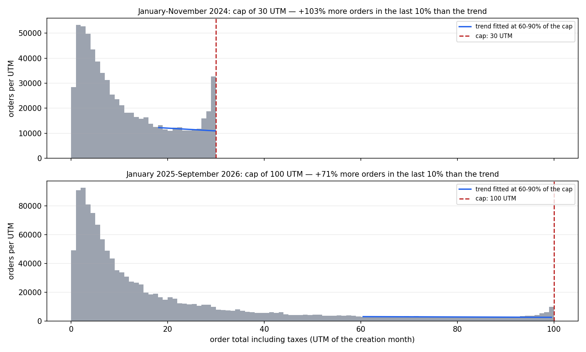
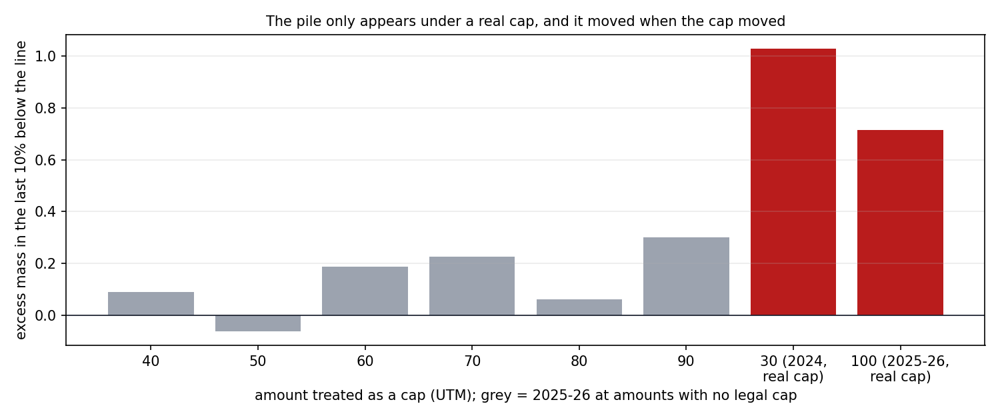
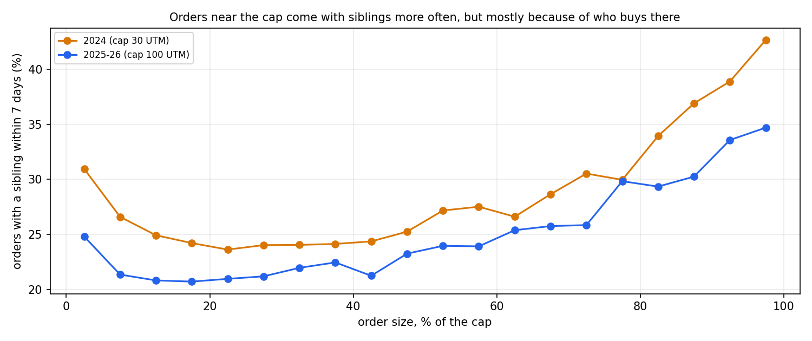
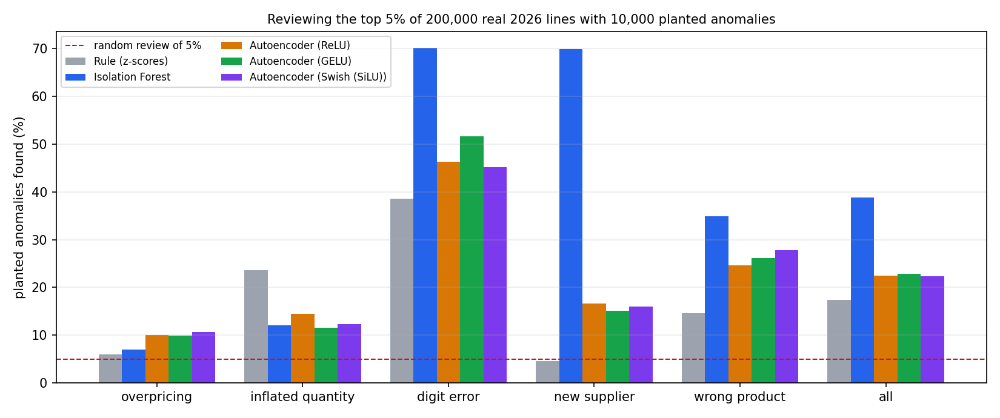
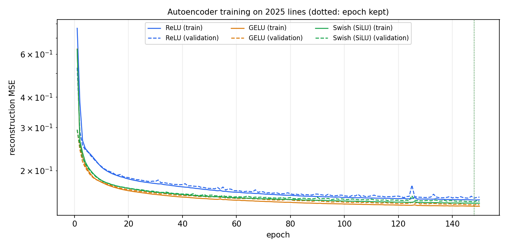

**[English](README.md) | [Español](README.es.md)**

# Public Procurement Anomaly Engine (Chile)

[](https://github.com/Rxyxs/mining-procurement-anomaly-engine/actions/workflows/ci.yml)  -2ea44f) 

En 13,7 millones de líneas reales de órdenes de compra de Mercado Público, las Compras Ágiles se acumulan justo bajo el tope legal, el doble de la tendencia con el tope antiguo de 30 UTM y 71% más con el nuevo de 100 UTM, y la acumulación se movió cuando la Ley 21.634 movió el tope; pero dentro de un mismo comprador, las órdenes pegadas al tope vienen con otra orden al mismo proveedor en la semana solo 2 puntos más seguido, así que la mayor parte de la acumulación parece compras ajustadas al límite y no compras partidas para quedar bajo él.

## Lo que encontré

| Hallazgo | Evidencia |
|---|---|
| **La acumulación sigue al tope** | Con el tope de 30 UTM (enero a noviembre de 2024), el último 10% bajo él tiene 103% más órdenes de Compra Ágil de lo que predice la tendencia (intervalo de 95%: 100% a 107%), unas 34.200 órdenes de más. Con el tope de 100 UTM (enero de 2025 a septiembre de 2026) tiene 71% más (68% a 75%), unas 18.300. En 30 UTM durante 2025-26, cuando ya no era tope, el exceso baja a 18%, en línea con seis montos que nunca fueron tope (-6% a +30%). |
| **El fraccionamiento es una señal débil, no la historia principal** | Las órdenes de 95-100% del tope tienen otra orden del mismo comprador al mismo proveedor dentro de 7 días más seguido que las de 60-90% (43% contra 32% en 2024). Comparando órdenes del mismo comprador, la diferencia baja a 2,6 puntos (1,7 a 3,6) en 2024 y a 1,7 puntos (0,6 a 2,8) en 2025-26; los pares del mismo día no son significativos después del cambio (p = 0,53). |
| **Igual queda una lista de trabajo para un auditor** | Desde 2025, 20.020 cadenas de órdenes de un comprador a un proveedor, cada una bajo el tope pero que juntas superan las 100 UTM con menos de una semana entre una y otra, concentran el 15,7% de todo el monto de Compra Ágil. No prueban nada, pero es por donde debería partir una revisión. |
| **Con líneas reales, el detector a usar es Isolation Forest** | Revisando el 5% superior de 200.000 líneas reales de 2026 con 10.000 anomalías plantadas, Isolation Forest encuentra el 38,8% (7,8 veces una revisión al azar), el autoencoder entre 22,4% y 22,9% según la activación, y la regla de z-scores el 17,4%. Con las facturas simuladas de la primera versión ganaba la regla; los datos reales invirtieron el orden. |
| **El sobreprecio se esconde en el ruido** | Un precio 3 a 8 veces más alto lo encuentra a lo más el 10,6% de las veces cualquier detector: los códigos de producto ONU son amplios ("exámenes médicos", "artículos de papelería"), así que los precios reales ya varían tanto. Un error de tipeo de mil veces se encuentra el 70,2% de las veces, igual que una cuenta alta de un proveedor sin historia. |

## Los datos

ChileCompra publica como datos abiertos cada orden de compra emitida por [Mercado Público](https://www.mercadopublico.cl), en un ZIP mensual con una fila por línea de orden. El pipeline descarga 32 meses (`python main.py --download`): enero a noviembre de 2024, cuando el tope de Compra Ágil era 30 UTM, y enero de 2025 a septiembre de 2026, después de que la [Ley 21.634](https://www.chilecompra.cl/ley-de-compras-publicas/) lo subiera a 100 UTM el 12 de diciembre de 2024. Diciembre de 2024 mezcla las dos reglas y queda fuera.

| | |
|---|---:|
| Líneas de órdenes | 13.742.385 |
| Órdenes de compra | 5.006.455 |
| Unidades de compra | 6.217 |
| Proveedores | 122.356 |
| Órdenes de Compra Ágil, 2024 (tope 30 UTM) | 686.395 |
| Órdenes de Compra Ágil, 2025-26 (tope 100 UTM) | 1.278.781 |

Cosas de los archivos que hubo que resolver antes de cualquier análisis:

- **Dos codificaciones en el mismo archivo.** Los CSV vienen en Windows-1252, salvo campos que llegan en UTF-8 (1.828 secuencias solo en enero de 2025, como "ISOFÁNICA"). Leer todo el archivo con una de las dos corrompe la otra; cada secuencia de bytes que es UTF-8 válido se lee como UTF-8 y el resto como Windows-1252.
- **El tope que aplica es el vigente cuando se creó la orden**, no cuando se envió: órdenes creadas con la regla antigua siguen apareciendo en los archivos de 2025. Los montos se convierten con la UTM del mes de creación.
- **El tope se aplica al total con impuestos.** Ninguna orden de Compra Ágil supera las 100 UTM brutas, mientras que los montos netos se detienen cerca de 84 UTM (100 / 1,19). Las 26 y 12 órdenes sobre el tope en cada período, y cinco órdenes de más de un billón de pesos, son errores de digitación.
- **La plataforma calcula los totales**: solo el 0,06% de las líneas tiene un total que no coincide con cantidad por precio, así que la anomalía de "total que no cuadra" de la primera versión, simulada, no existe en los datos reales.
- **Compradores y proveedores se guardan como códigos.** En los resultados no aparece el nombre de ningún comprador ni proveedor: todo lo que se publica acá es agregado.

## 1. La acumulación bajo el tope



Órdenes de Compra Ágil por monto total: con cualquiera de las dos reglas, la densidad es plana entre el 60% y el 90% del tope y sube con fuerza en el último 10% bajo él, que es donde se mide el exceso contra una recta ajustada en la parte plana.



La misma medida en montos que nunca fueron tope queda entre -6% y +30%; bajo los topes reales es 103% y 71%, y en 30 UTM bajó a 18% apenas el tope se fue de ahí.

| Dónde se mide el exceso | Exceso | Intervalo de 95% | Órdenes de más |
|---|---:|---:|---:|
| 30 UTM, 2024 (tope) | 103,0% | 99,5% a 107,1% | 34.223 |
| 100 UTM, 2025-26 (tope) | 71,5% | 68,0% a 75,2% | 18.319 |
| 30 UTM, 2025-26 (ya no es tope) | 18,1% | 15,5% a 20,6% | |

Qué tan seguro es el tamaño: el exceso depende del contrafactual. Con una constante o una recta, tres rangos de ajuste y tres anchos de ventana (18 especificaciones), va de 52% a 139% bajo el tope de 30 UTM y de 26% a 138% bajo el de 100 UTM. La dirección nunca está en duda; el porcentaje exacto sí. Un polinomio de quinto grado, la opción de manual, oscilaba entre +65% y -747% según el grado y no se usa.

## 2. ¿Compras partidas o compras ajustadas al tope?

Una acumulación bajo un tope calza con dos conductas que el histograma no puede separar: un comprador que ajusta la compra al máximo permitido, que es legal, y una compra partida en dos para quedar bajo él, que la ley prohíbe. Partir una compra deja una huella: otra orden del mismo comprador al mismo proveedor con pocos días de diferencia.



La proporción de órdenes con otra orden del mismo comprador y proveedor dentro de 7 días sube cerca del tope con las dos reglas, de cerca de 21% a 34% después del cambio.

Pero los compradores que compran cerca del tope también son los que repiten compras seguido. Comparando órdenes *de la misma unidad de compra* (un modelo de probabilidad lineal con efectos fijos por comprador y errores agrupados por comprador), la mayor parte de la diferencia desaparece:

| Período | Con orden hermana: 95-100% del tope | 60-90% | Dentro del mismo comprador | Intervalo de 95% | Hermana el mismo día, mismo comprador |
|---|---:|---:|---:|---:|---:|
| 2024 (tope 30 UTM) | 42,8% | 31,9% | +2,6 puntos | +1,7 a +3,6 | +1,1 puntos (p = 0,025) |
| 2025-26 (tope 100 UTM) | 34,8% | 28,7% | +1,7 puntos | +0,6 a +2,8 | +0,3 puntos (p = 0,53) |

Así que la acumulación es sobre todo de compras ajustadas al límite. El fraccionamiento sí aparece en los datos, como una diferencia de uno o dos puntos, no como la explicación de la acumulación. Lo que un auditor igual puede usar: desde 2025, **20.020 cadenas** de órdenes de un comprador a un proveedor, cada una bajo el tope y cada una a menos de 7 días de la anterior, suman más de 100 UTM. Son el 7,0% de las órdenes de Compra Ágil y el 15,7% del monto; en 2024 eran el 16,0% de las órdenes y el 24,5% del monto. Las compras recurrentes legítimas (alimentos, insumos) se ven igual, así que esto es un orden de revisión, no un hallazgo.

## 3. Detectores sobre líneas reales

Las órdenes reales no traen etiquetas, así que los tres detectores de la primera versión se comparan sobre un fondo real. Se entrenan con 400.000 líneas de 2025; después se plantan 10.000 anomalías de cinco tipos (2.000 de cada uno) en 200.000 líneas reales de 2026, y cada detector las ordena todas. La métrica es la proporción de líneas plantadas en su 5% superior, lo que encontraría un equipo que revisa una de cada veinte líneas. Las anomalías reales que ya trae la data cuentan en contra de los detectores, como pasaría en una revisión de verdad.

Las features comparan cada línea con lo que suele costar su producto. Producto es código ONU y unidad de medida, con mediana y MAD de 2025 (12.453 grupos que cubren el 92% de las líneas de 2026): precio, cantidad y total como z-scores robustos, la distancia a lo que *el mismo comprador* pagó antes por el mismo producto, la antigüedad del proveedor en la data y la historia entre comprador y proveedor.



| Detector | Todas | Sobreprecio ×3-8 | Cantidad ×5-10 | Error de tipeo ×1.000 | Proveedor nuevo, cuenta alta | Precio de otro producto |
|---|---:|---:|---:|---:|---:|---:|
| Isolation Forest | 38,8% | 7,0% | 12,0% | 70,2% | 70,0% | 34,9% |
| Autoencoder (GELU) | 22,9% | 9,9% | 11,6% | 51,6% | 15,2% | 26,2% |
| Autoencoder (ReLU) | 22,4% | 10,1% | 14,5% | 46,2% | 16,7% | 24,6% |
| Autoencoder (Swish (SiLU)) | 22,4% | 10,6% | 12,3% | 45,2% | 16,0% | 27,8% |
| Regla (z-scores) | 17,4% | 5,9% | 23,5% | 38,6% | 4,5% | 14,5% |

Una revisión al azar del 5% encuentra el 5%. Isolation Forest gana porque usa la historia del proveedor, donde los proveedores nuevos plantados destacan, y porque las combinaciones extremas se aíslan rápido en un árbol. La regla solo mira precios y cantidades y es la mejor con cantidades infladas. El autoencoder queda al medio con cualquier activación; su mejor época fue la 148 de 150, así que todavía mejoraba lentamente.



Error de reconstrucción en líneas de 2025 para las tres activaciones; la curva de validación sigue a la de entrenamiento, sin sobreajuste.

Los dos cambios que hicieron usables los detectores con datos reales fueron las estadísticas robustas (mediana y MAD, porque los precios reales tienen colas pesadas y una media y una desviación estándar se dejan arrastrar por los mismos valores extremos que se buscan) y la comparación con los precios que pagó antes el mismo comprador: sin ella, durante el desarrollo, Isolation Forest encontraba cerca de un tercio de las anomalías plantadas y se le escapaba la mayoría de los errores de tipeo.

## Qué cambió respecto de la primera versión

La primera versión detectaba anomalías en 15.000 facturas simuladas de una minera, con anomalías inyectadas por el mismo código que generaba los datos. Ahora corre sobre todas las órdenes de compra públicas de Chile. Los detectores siguen, evaluados de la misma forma pero sobre un fondo real, y los dos análisis nuevos (el tope y las compras partidas) responden preguntas que solo los datos reales permiten hacer. El repositorio mantiene su nombre; su tema ya no son las compras mineras.

## Stack tecnológico

| Capa | Tecnología | Rol |
|---|---|---|
| Datos | **urllib**, **Polars**, **Parquet** | Descarga, lectura con codificación mixta, 13,7 M de líneas en 313 MB |
| Estadística | **NumPy**, **statsmodels** | Estimador de acumulación, modelos con efectos fijos y errores agrupados |
| Detección | **scikit-learn** (Isolation Forest), **PyTorch** (autoencoder) | Detectores no supervisados y comparación de activaciones |

## Cómo correrlo

```powershell
py -m venv venv
./venv/Scripts/pip install -r requirements.txt
./venv/Scripts/python main.py --download   # una vez: 32 ZIP mensuales (~3 GB, unos 10 minutos) y la UTM
./venv/Scripts/python main.py              # unos 20 minutos en la CPU de un notebook
```

Escribe `results/results.json`, la fuente de cada cifra de este README, y los gráficos en `results/figures/`.

### Tests

```powershell
./venv/Scripts/pytest -v
```

Los tests corren sin red sobre datos de prueba pequeños: el decodificador de codificación mixta, la lectura (decimales con coma, saltos de línea dentro de campos, valores faltantes), el tope vigente según la fecha de creación, el estimador de acumulación sobre una densidad plana y sobre una acumulación plantada, las órdenes hermanas y las cadenas, el modelo dentro del comprador sobre datos con un efecto conocido, features de historia que solo miran hacia atrás, las anomalías plantadas, el autoencoder y un chequeo de que cada cifra de las tablas de los dos README coincide con `results/results.json`.

## Licencia

MIT — ver [LICENSE](LICENSE).

## Autor

**Pablo Reyes** — [github.com/Rxyxs](https://github.com/Rxyxs)
