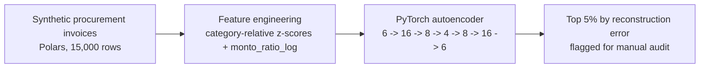
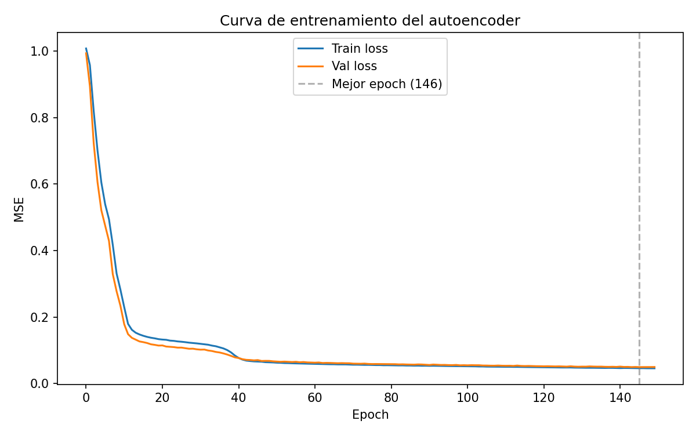
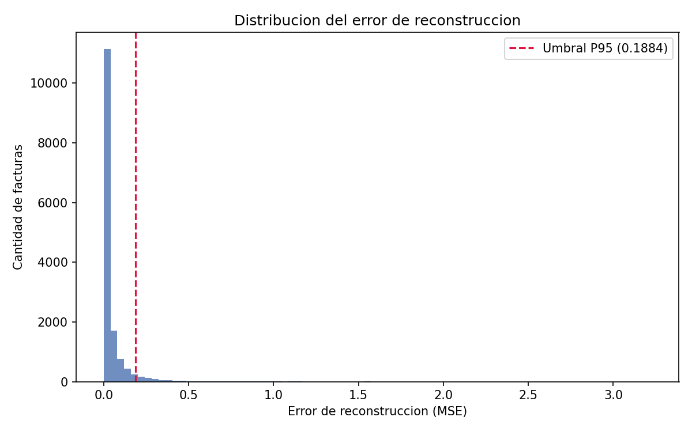
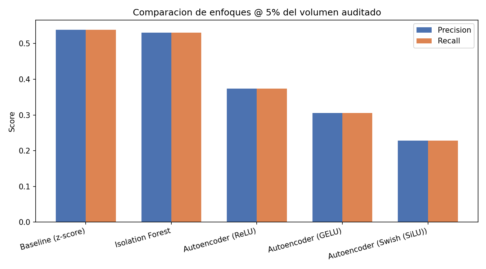
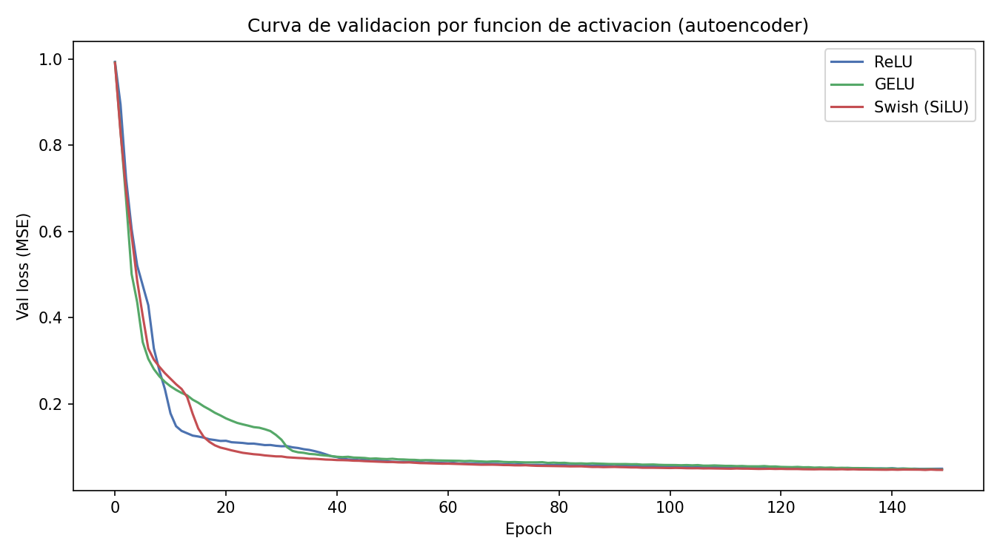

<h1 align="center">Mining Procurement Anomaly Engine</h1>

<p align="center">
  <a href="README.es.md">Español</a> · <b>English</b>
</p>

<p align="center">
  
  
  
  
</p>

An unsupervised anomaly-detection system for mining procurement invoices. A
PyTorch autoencoder is trained on tabular invoice features and the 5% of
invoices with the highest reconstruction error are isolated as candidates for
manual audit — no labeled fraud data required.

## Why this project

Mining operations run large, recurring procurement spend across dozens of
supplier categories (explosives, CAEX tires, crushing spares, fuel,
maintenance services) at wildly different price scales. Manual invoice audit
doesn't scale, and rule-based checks only catch the fraud patterns someone
already thought to write a rule for. An unsupervised model that learns "what
a normal invoice looks like" and flags whatever it can't reconstruct well
gives an audit team a ranked worklist without needing historical fraud labels
— which mining procurement departments in Chile generally don't have.

## Business Impact & Key Performance Indicators

| Metric | Result | What it means |
|---|---|---|
| Overall recall at a fixed 5% audit budget | 37.3% (280/750 injected anomalies) | **~7.5x** better than the ~5% recall a random 5% sample would get by chance |
| Best-detected fraud type | Overpricing (3-8x), 0.54 recall | The reconciliation feature (`monto_ratio_log`) is what makes this and other patterns detectable at all |
| Hardest fraud type, honestly reported | Quantity inflation, 0.06 recall | Root-caused to the training set's own per-category std being contaminated by the fraud it's meant to detect -- a documented trade-off, not hidden |
| Real bug fixed: category-blind scaling | ~16% recall → 37.3% after category-relative z-scores | Global `StandardScaler` let between-category price variance drown out within-category anomalies |

## How it works



1. **Synthetic data** (`generate_procurement_data`, Polars): 15,000 invoices
   across 8 procurement categories, 6 mining regions, and 180 suppliers, with
   category-specific log-normal price/quantity distributions. No public
   dataset of Chilean mining procurement invoices exists, so the generator
   models realistic category price scales (fuel ~$850 CLP/liter vs. CAEX
   tires ~$8.5M CLP/unit) instead of fabricating arbitrary numbers.
2. **Anomaly injection** (5% of rows): five distinct fraud patterns —
   overpricing (3-8x), inflated quantity (5-10x), an invoice total that
   doesn't reconcile with quantity × unit price (1.4-2.5x), a unit price
   drawn from a mismatched category's distribution, and a brand-new supplier
   billing an unusually high amount. The label is kept **only** to validate
   the model afterward — it is never used during training.
3. **Feature engineering**: raw price/quantity are log-normal and span
   several orders of magnitude *between* categories, so they're expressed as
   a z-score *relative to their own category* (fit on the train split only,
   to avoid leakage) instead of raw values. A `monto_ratio_log` feature
   directly exposes whether the declared total reconciles with quantity ×
   unit price — this single engineered feature is what makes the
   reconciliation-break and new-supplier fraud types detectable at all (see
   Results).
4. **Autoencoder** (PyTorch, CPU): 6 → 16 → 8 → 4 → 8 → 16 → 6, trained with
   Adam + MSE loss and early stopping on a validation split.
5. **Detection**: reconstruction error is computed for every invoice; the
   95th-percentile threshold isolates the top 5% as anomalous.

## Results

From an actual run (seed 42, 15,000 invoices, 750 injected anomalies):

<p align="center">
  
  
</p>

- Training converged smoothly over 150 epochs (best epoch 146), train/val
  loss tracking closely with no overfitting.
- **Overall: 280/750 injected anomalies captured in the top 5% by
  reconstruction error (37.3% recall / 37.3% precision** — precision equals
  recall here because the flagged set size is fixed at exactly 5% of the
  data, same as the true anomaly rate).
- That is ~7.5x better than the ~5% recall a random 5% sample would get by
  chance.

**Recall by injected anomaly type** (this breakdown is the honest part of
the result — not all fraud patterns are equally separable at a fixed 5%
budget):

| Anomaly type | Recall | Detected / injected |
|---|---|---|
| Overpricing (3-8x) | 0.54 | 83/155 |
| New supplier + inflated total | 0.51 | 77/152 |
| Total doesn't reconcile with line items | 0.45 | 69/153 |
| Category/price mismatch | 0.30 | 43/145 |
| Inflated quantity (5-10x) | 0.06 | 8/145 |

**Honest finding**: quantity inflation is structurally the hardest pattern
to catch here. `cantidad_zscore_categoria`'s per-category standard deviation
is estimated from an unsupervised training set that already contains ~1% of
this exact fraud type — the estimate is contaminated by the very outliers
it's meant to detect, which widens the "normal" range and dulls the signal.
Switching to a robust median/MAD estimator fixes quantity inflation (recall
0.06 → 0.17) but *lowers* overall recall (37.3% → 33.6%), because it
re-shuffles which anomaly type wins the fixed top-5% budget — a real
trade-off, not a bug, documented in `compute_category_stats()`'s docstring
in [autoencoder.py](autoencoder.py). The mean/std version is kept as the
default because it has the higher overall recall.

Two real bugs were found and fixed while building this, both by running the
pipeline and inspecting actual numbers rather than trusting the design:
1. Feeding raw price/quantity/amount into the autoencoder gave only ~16%
   recall — a global `StandardScaler` let the variance *between* categories
   (order-of-magnitude price differences) drown out anomalies *within* a
   category. Fixed with category-relative z-scores.
2. A category/price-mismatch anomaly can produce a raw z-score of dozens of
   standard deviations (a tire price evaluated against fuel's distribution),
   and one supplier category (`Servicios Mantención`) has >50% of its
   invoices at quantity=1, making its median-absolute-deviation exactly
   zero — both produced instability/`NaN`s that needed winsorizing and a
   MAD floor respectively.

## Model comparison: 3 complementary approaches

`models_comparison.py` evaluates three complementary detection approaches
on the exact same features/split as the autoencoder above, plus an
activation-function ablation of the autoencoder itself (ReLU vs. GELU vs.
Swish/SiLU, same architecture and seed for all three). All approaches are
scored the same way: isolate the top 5% by anomaly score and measure
precision/recall against the injected labels.

| Approach | Precision @5% | Recall @5% | TP / injected |
|---|---|---|---|
| Baseline (combined z-score rule, no training) | 0.539 | 0.539 | 404/750 |
| Isolation Forest (300 trees) | 0.531 | 0.531 | 398/750 |
| Autoencoder — ReLU | 0.373 | 0.373 | 280/750 |
| Autoencoder — GELU | 0.305 | 0.305 | 229/750 |
| Autoencoder — Swish (SiLU) | 0.228 | 0.228 | 171/750 |

<p align="center">
  
  
</p>

**Honest finding**: on this particular synthetic dataset, the simple
interpretable baseline and Isolation Forest *both beat* the autoencoder on
recall. The z-score rule directly sums the same three engineered signals
(`precio_zscore_categoria`, `cantidad_zscore_categoria`,
`monto_ratio_log`) the fraud injection manipulates, so it has no
representation to learn — it's the signal. The autoencoder has to learn
that representation from reconstruction error alone, and pays for it in
recall on a dataset this size (15,000 rows, 6 features). This is a
realistic illustration of why interpretable baselines belong in the
comparison and not just as a formality: added model complexity isn't free,
and here it isn't paying for itself. Among the three activations, ReLU
converges to the best detection recall despite GELU/Swish reaching a
*lower* validation MSE — smoother activations reconstruct the bulk of
normal invoices better but also partially reconstruct the anomalies,
which is exactly the opposite of what the top-5%-by-error threshold needs.

Metrics and per-invoice predictions for all five approaches are persisted
to `results/metrics.duckdb` (tables `approach_metrics`, `predictions`) so
they can be queried directly with SQL, e.g.:

```sql
SELECT approach, precision, recall FROM approach_metrics ORDER BY recall DESC;
```

## Project structure

```
mining-procurement-anomaly-engine/
├── autoencoder.py          # data generation, feature engineering, autoencoder training/evaluation
├── models_comparison.py    # baseline z-score rule + Isolation Forest + activation comparison, DuckDB persistence
├── tests/
│   └── test_models_comparison.py  # pytest unit tests for all 3 approaches
├── requirements.txt
├── data/                  # generated dataset (gitignored, regenerated by running the script)
├── models/                # trained model checkpoint (gitignored)
└── results/               # anomalies CSV + metrics.duckdb (gitignored) + committed plots
```

## Running it

```powershell
py -3.10 -m venv venv
.\venv\Scripts\python.exe -m pip install -r requirements.txt
.\venv\Scripts\python.exe autoencoder.py
.\venv\Scripts\python.exe models_comparison.py
```

`autoencoder.py` writes `data/procurement_invoices.csv` (full synthetic
dataset), `models/autoencoder.pt` (trained weights), and three files in
`results/`: `anomalias_detectadas.csv` (the flagged invoices, ranked), plus
the training curve and reconstruction-error histogram shown above.
`models_comparison.py` reuses that same dataset (or regenerates it if
missing), adds `results/metrics.duckdb`, `results/model_comparison.png`
and `results/activation_comparison.png`.

### Tests

```powershell
.\venv\Scripts\python.exe -m pytest tests/ -v
```

## License

MIT — see [LICENSE](LICENSE).

## Author

**Pablo Reyes** — [github.com/Rxyxs](https://github.com/Rxyxs)
